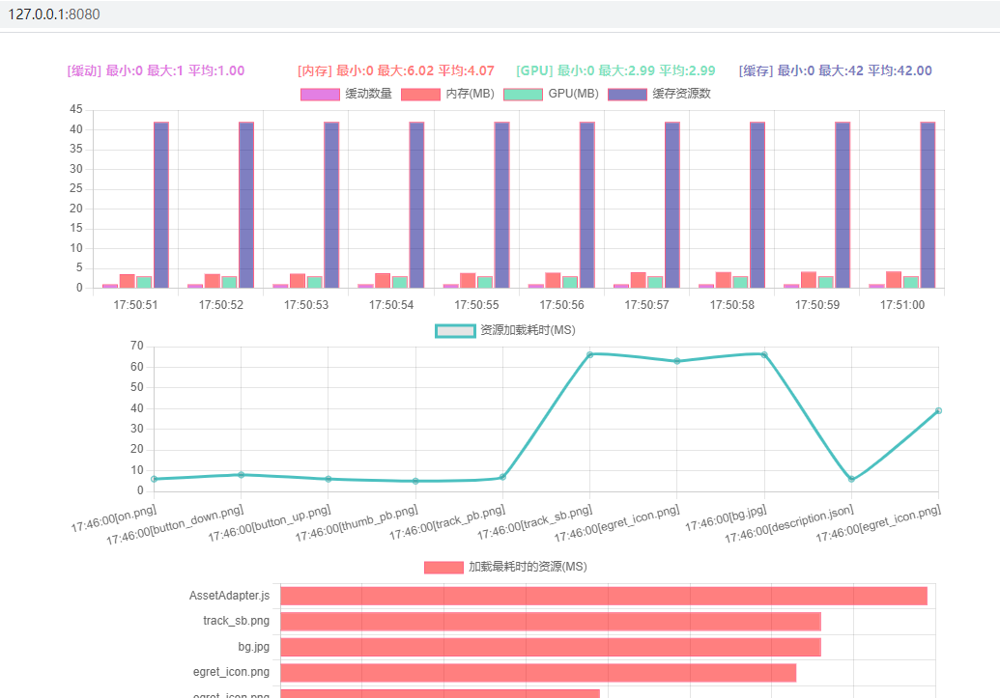

# BetaWeb
使用Puppeteer测试基于Egret引擎编写的游戏

## 最小支持版本
Egret 5.2.x

## 运行
### 1.安装运行环境
```
npm install
```

### 2.修改配置
src/config/config.ts
```
export const GAME_URL = "http://127.0.0.1:3000/index.html";
```

### 3.编译运行
编译

vscode ctrl+shift+b

运行

vscode F5

### 4.测试错误日志
目录 ./logs

all.log 所有日志
pageerror.log 游戏错误日志
performance.log 游戏性能日志
requestfailed.log 游戏资源请求失败日志

### 5.打开监控控制面板
浏览器输入 http://127.0.0.1:8080/
